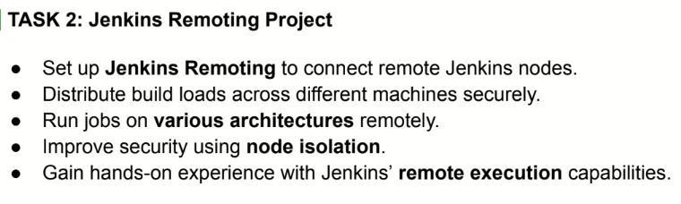
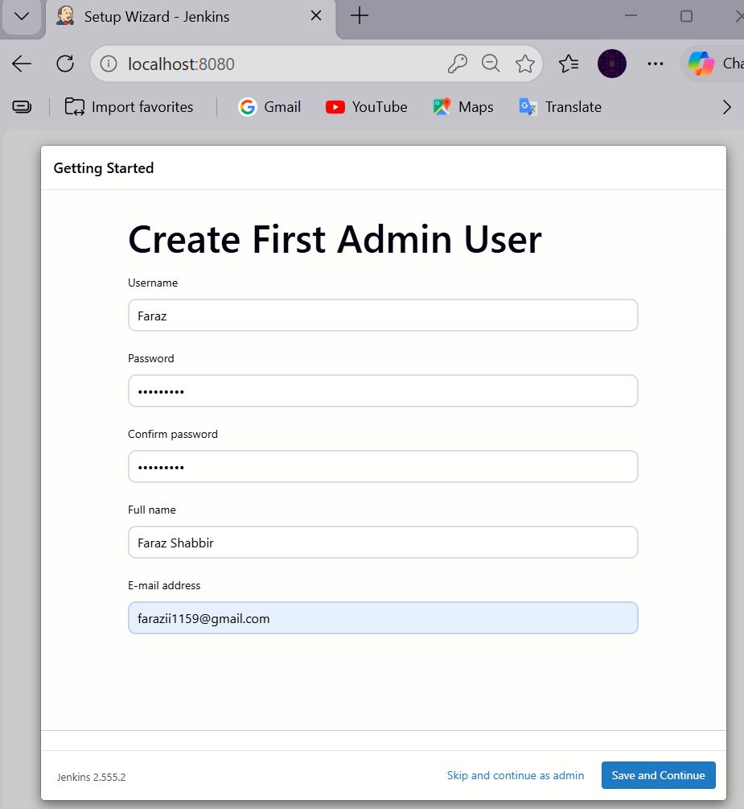
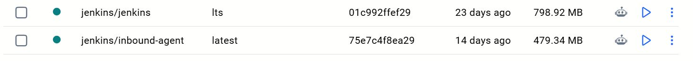
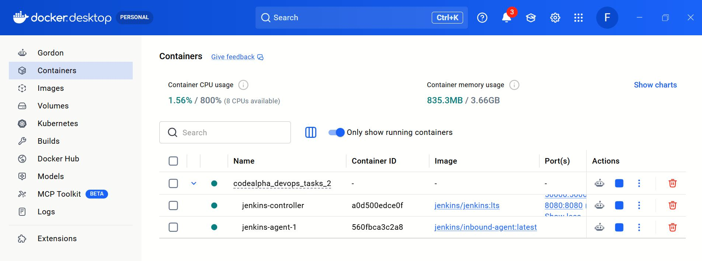
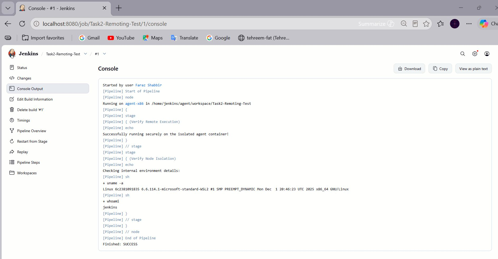
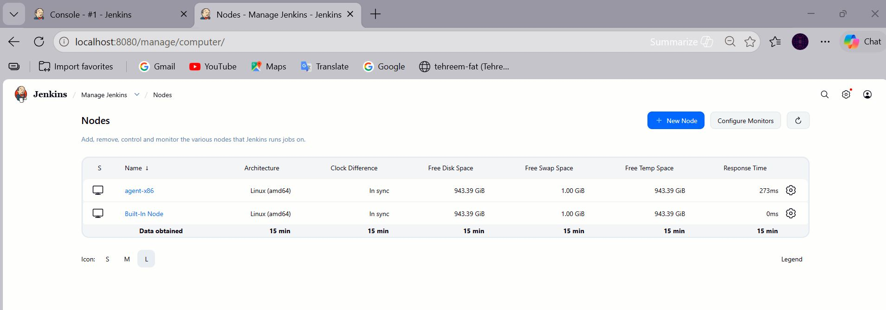

# Distributed Jenkins Architecture with Secure Node Isolation

This repository contains my official submission for **Task 2 (Jenkins Remoting Project)** of my DevOps Internship at **CodeAlpha**. The project demonstrates a fully functional, secure, and distributed CI/CD infrastructure utilizing Jenkins Remoting to execute pipeline jobs across isolated environment nodes.

---

## 📋 Task Objectives & Requirements

Below is the official task description provided by CodeAlpha:



As outlined in the internship requirements, this project successfully fulfills the following milestones:
* **Set up Jenkins Remoting** to seamlessly connect remote Jenkins nodes.
* **Distribute build loads** across different machines securely.
* **Run jobs on a dedicated Jenkins remote agent using Jenkins Remoting.**
* **Improve security** using strict node isolation.
* **Gain hands-on experience** with Jenkins’ remote execution capabilities.

---

## 🛠️ Infrastructure & Technologies Used
* **Host OS:** Windows (Using Docker Desktop / Git Bash)
* **Guest OS / Virtualization:** CentOS 9 Stream running inside Oracle VM VirtualBox
* **Containerization:** Docker & Docker Compose
* **CI/CD Engine:** Jenkins (Controller-Agent Topology)
* **Protocols:** JNLP / Inbound Agent Remoting via Port `50000`

---

## ✨ Key Features

- Jenkins Controller-Agent Architecture
- Jenkins Remoting (JNLP)
- Secure Container-based Isolation
- Distributed Pipeline Execution
- Docker-Based Deployment

---
📂 Repository Structure
## 📂 Repository Structure

CODEALPHA_Devops_TASK_2/
├── Images/
├── docker-compose.yml
└── README.md

## 🚀 Step-by-Step Implementation (How I Built It)

### Step 1: Networking & Virtualization Setup
* Provisioned a CentOS 9 Linux virtual machine inside VirtualBox to serve as the remote node infrastructure.
* Configured networking to ensure stable, bidirectional communication (`ping`) between the Windows Host machine and the CentOS 9 VM.

### Step 2: Defining the Infrastructure via Docker Compose
* Created a customized `docker-compose.yml` configuration.
* Isolated the **Jenkins Controller** into its own secure container.
* Exposed port `8080` for the web UI and port `50000` to handle the inbound Jenkins Remoting agent traffic.

### Step 3: Initial Jenkins Setup & Admin Provisioning
* Initialized the Jenkins Controller web application interface.
* Configured and provisioned the primary administrator user account securely to establish a clean controller instance.

### Step 4: Jenkins Node Configuration

A Jenkins node named "agent-x86" is created in the Jenkins UI.

The actual agent connection is handled automatically via Docker Compose using inbound-agent container.

### Step 5: Connecting the Agent via JNLP Remoting

* Spun up an isolated `jenkins/inbound-agent` container on the remote machine context.
* Passed the Controller URL, the Node Name (`agent-x86`), and the secret token into the container setup.
* Verified that the agent connected successfully and the node status changed to **Online**.


### Step 6: Designing & Executing the Remote Pipeline
* Wrote a declarative Jenkins Pipeline targeted specifically to run on the isolated architecture:
```groovy
pipeline {
        agent { label 'x86-architecture' }
        
        stages {
            stage('Verify Isolation & Architecture') {
                steps {
                    sh 'uname -a'
                }
            }
        }
    }
    
```
* Executed the job and verified through the console output that the build was securely offloaded from the Controller and processed inside the isolated x86 environment.
```
```
### 💻 Quick Start Guide: How to Clone & Run This Project Locally

Follow these clear instructions to replicate this entire distributed environment on your own local setup.
```
```
### Prerequisites
Make sure you have the following tools installed on your operating system:
* [Git](https://git-scm.com/)
* [Docker Desktop](https://www.docker.com/products/desktop/) (with Docker Compose enabled)
```

```
### Step 1: Clone the Repository
Open your terminal (Git Bash, VS Code Terminal, or Command Prompt) and clone this repository down to your local machine:
```bash
git clone https://github.com/farazii1159/CODEALPHA_Devops_TASK_2.git
cd CODEALPHA_Devops_TASK_2
```
---


### Step 2: Launch the Infrastructure
Run Docker Compose to pull the official images and spin up the environment containers automatically in the background:

```bash
docker compose up -d
```

This command starts up the Jenkins Controller, which manages pipeline execution and agent communication within the distributed CI/CD environment.

---
### Step 3: Unlock & Access Localhost Jenkins
Open your web browser and go to: http://localhost:8080

To unlock the dashboard, retrieve the temporary administrator password from your running container logs by executing:

```bash
docker compose logs jenkins-controller
```

Copy the long alpha-numeric key string, paste it into the Jenkins browser tab setup page, select Install Suggested Plugins, and create your primary admin profile.

---
### Step 4: Register the Inbound Agent Node
Inside Jenkins UI, navigate to Manage Jenkins -> Nodes -> New Node.

Input the node name as agent-x86, tick Permanent Agent, and click Create.

Configure the agent screen properties with the exact values below:

* Remote root directory: /home/jenkins/agent

* Labels: x86-architecture

* Launch method: Choose Launch agent by connecting it to the controller (Inbound/JNLP Remoting style).

 Save the node settings, click on the offline node description title, and copy the unique security token Secret Key generated by the dashboard.

---
### Step 5: Jenkins Agent Deployment (Docker Compose Managed)

The Jenkins inbound agent is automatically started using **docker-compose.yml**.

It connects using:
- JENKINS_URL
- JENKINS_SECRET
- JENKINS_AGENT_NAME
---

### ⚠️ Note:
This project includes a hardcoded Jenkins secret in **docker-compose.yml** for demonstration purposes only. In production, secrets should be managed using environment variables or secret management tools.

Go back to http://localhost:8080/manage/computer/, refresh the page, and you will see agent-x86 turn online and display an "In sync" state status confirmation icon.
 
 ---
### Step 6: Create and Verify Your Test Pipeline
Click New Item on the top-left sidebar menu, name your job Task2-Execution-Test, pick Pipeline, and click OK.

Scroll right down to the Pipeline Script code block section at the bottom, paste this automated script test workflow, and hit Save:

```groovy
pipeline {
    agent { label 'x86-architecture' }

    stages {
        stage('Verify Isolation & Architecture') {
            steps {
                echo 'Successfully executing pipeline code inside the isolated agent node!'
                sh 'uname -a'
            }
        }
    }
}
```

3. Click **Build Now**. Once the process completes, navigate directly inside the build job numbers link to review its **Console Output**. You will see it successfully offloaded execution onto `agent-x86` and completed with an error-free `Finished: SUCCESS` status output!

---
### 🚀 Architecture Overview
Jenkins Controller (Docker Container)
        │
        ▼
Docker Network (jenkins-net)
        │
        ▼
Jenkins Agent (inbound-agent container)
        │
        ▼
Pipeline Execution (x86 Label)


This architecture demonstrates a **Controller-Agent model** where:
- Jenkins Controller manages jobs
- Agent executes workloads
- Docker provides container isolation

---

## 🔒 Security & Optimization Highlights
* **Controller Isolation:** By enforcing node execution on `agent-x86`, the main Jenkins Controller configurations, credentials, and plugins are completely isolated from potentially malicious or resource-heavy build scripts.
* **Load Balancing:** Heavy compiler or test loads are distributed to remote execution planes, ensuring high availability of the master Jenkins dashboard.

---

## ✅ Results

* Jenkins Controller deployed successfully
* Remote Agent connected successfully
* Jenkins Remoting verified
* Pipeline executed on the isolated agent node
* Build completed with `SUCCESS` status

---

## 📊 Task Verification & Screenshots

### 1. Initial Administrator Setup
Verification of the initial Jenkins setup deployment wizard, establishing the primary admin credentials.


### 2. Docker Desktop Cached Images
Verification of downloaded Docker images inside the local environment library plane.


### 3. Docker Desktop Running Container Infrastructure
Verification of active container groups securely running the isolated infrastructure stack.


### 4. Connected Nodes Dashboard (Connection Success)
Verification that the `agent-x86` node is fully authenticated, connected, and "In sync" with the controller via Jenkins Remoting.



### 5. Successful Pipeline Console Execution
The successful pipeline build log showing the workload offloaded to `agent-x86` inside the isolated environment, executing `uname -a` and completing with a SUCCESS status.


---

## 👨‍💻 Author

**Faraz Shabbir**

- GitHub: [farazii1159](https://github.com/farazii1159)
- LinkedIn: [Faraz Shabbir](https://linkedin.com/in/faraz-shabbir-5a9227344)
- Organization / Affiliation: CodeAlpha
- Company: [CodeAlpha](https://www.linkedin.com/company/codealpha/)

---
**Submitted as part of CodeAlpha DevOps Internship Program**
